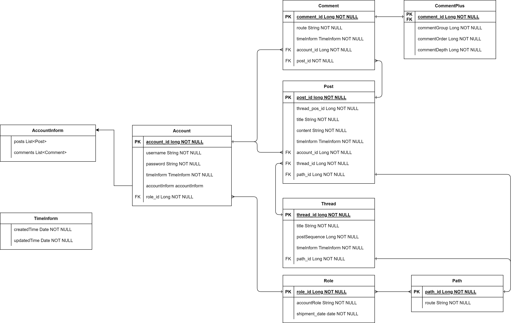

# SpringBoardAuthority

 

# 개요
- Spring Security를 활용한 동적 권한 구현
  
- Spring Data Jpa의 페이징 기능을 활용한 게시판 구현

- QueryDsl 활용한 검색 기능 구현

 

# 사용 기술

> ## BackEnd
- JDK 11
- Spring Boot v2.7.11
- Spring Data Jpa
- QueryDsl
- Spring Security
- Spring Validation
- Lombok

> ## Database
- H2 DB

> ## FrontEnd
- HTML
- Thymleaf
- BootStrap v5.1

> ## IDE
- IntelliJ IDEA

 

# 구조도

# 

 

# 해본 것

- anyRequest().access() 흘 활용한 동적 권한 설정
  - 각 권한이 접근 가능한 경로 설정
  - 각 계정의 권한 설정

- JpaRepository와 QueryDsl 연결

- QueryDsl을 활용한 동적 쿼리

- 댓글과 대댓글 기능

- 백엔드 데이터 검증

 

# 느낀 점
- JpaRepository의 findAll() 로 뽑아와서 map() 해서 값들 뽑아오지 말기... 이거 때문에 쿼리가 비효율적으로 출력되는 것 같다.