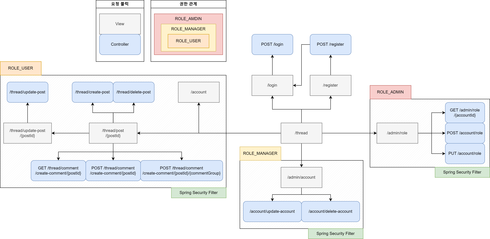
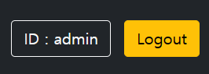

# SpringBoardAuthority

 

# 개요
- Spring Security를 활용한 동적 권한 구현
  
- Spring Data Jpa의 페이징 기능을 활용한 게시판 구현

- QueryDsl 활용한 검색 기능 구현

 

# 사용 기술

> ## BackEnd
- JDK 11
- Spring Boot v2.7.11
- Spring Data Jpa
- QueryDsl
- Spring Security
- Spring Validation
- Lombok

> ## Database
- H2 DB

> ## FrontEnd
- HTML
- Thymleaf
- BootStrap v5.1

> ## IDE
- IntelliJ IDEA

 

># 구조도

># 와이어프레임

 

># 계층 구조

 

># 엔티티 구조

 

># 서비스 설명

>## **메인 페이지**

### 1. 로그인 메뉴  

- *로그인 되지 않은 경우*  

  - 오른쪽 상단 메뉴에서 로그인 메뉴 또는 가입 페이지로 이동할 수 있음

 

- *로그인된 경우*  

  - 로그인한 상태의 경우 위와 같이 바뀌며, 사용자의 정보와 비밀번호를 바꿀 수 있는 페이지로 이동할 수 있는 버튼과 로그아웃 버튼이 있음

 

### 2. 권한에 따른 메뉴

- *로그인 하지 않았거나 권한이 ROLE_USER 인 경우*  

    - 메인 페이지로 돌아가는 메뉴만 존재함

 

- *권한이 ROLE_MANAGER 인 경우*  

  - 계정 관리 페이지로 갈 수 있는 메뉴가 추가됨

 

- *권한이 ROLE_ADMIN 인 경우*   

  - 롤 관리 페이지로 갈 수 있는 메뉴가 추가됨

 

### 3. 게시판

- *기본*

  - 게시글을 클릭할 시 로그인 페이지로 이동함
  - 아래 쪽 숫자 버튼을 클릭하여 페이징 함
  - 게시글의 제목, 내용, 글쓴이로 검색할 수 있음

 

<u>검색 및 페이징 내용</u>

- *페이징*

  - 페이징된 페이지는 파란색으로 강조된다.
  - 사용할 수 있는 페이지 넘김은 파란색으로 강조된다.

 

- *검색*

  - 게시글의 제목, 내용, 글쓴이로 검색할 수 있음

 

- *로그인을 한 경우*

  - 오른쪽 상단에 게시글을 작성하는 버튼이 추가됨

---
 

>## 게시글 페이지

- *게시글 페이지*

  - 게시글을 보고, 수정하고 삭제할 수 있음
  - 사용자 자신이 작성한 게시글만 수정 및 삭제가 가능함

 

<u>게시글 삭제 및 수정 기능</u>

- *게시글 수정*

  - 수정하기 버튼을 클릭하면 수정 페이지가 나온다.
  - 수정 페이지에서 내용을 변경할 수 있다.

 

- *게시글 삭제*

  - 삭제하기 버튼을 클릭하면 팝업창이 나온다.
  - 팝업창의 삭제하기 버튼을 누르면 포스트를 삭제할 수 있다.

<u>댓글 및 대댓글 작성</u>

- *댓글 작성*

  - 입력 칸에 댓글을 작성하고 댓글 버튼을 클릭하여 등록할 수 있다.

 

- *대댓글 작성*

  - 작성된 댓글에 reply 버튼을 클릭하면 대댓글 작성칸이 나온다.

---
 

>## 가입 및 로그인 페이지

### 1. 가입 페이지
- *기본*  

  - 유저 이름과 비밀번호 체크를 통해 계정을 생성할 수 있음

 

<u>가입 검증</u>

- *검증*    

  - 잘못된 양식의 유저 이름과 비밀번호를 제출할 경우 다음과 같이 표시함

 

### 2. 로그인 페이지
- *기본*  

  - 로그인 페이지를 통해 로그인할 수 있음

 

<u>로그인 실패 시</u>

- *로그인 실패*    

  - 로그인 실패 시 빨간 폰트로 나타냄

---
 

>## 사용자 계정 페이지

- *사용자 계정 페이지*  

  - 로그인한 사용자 계정의 정보를 볼 수 있으며, 계정의 비밀번호를 변경할 수 있음

 

<u>패스워드 변경 시 검증</u>

- *로그인 실패*    

  - 조건에 맞지 않는 패스워드가 입력될 경우 틀린 내용을 반환함.

---
 

>##  관리자 페이지
### 1. 계정 관리자 페이지
- *기본*  

  - 가입된 사용자의 권한을 수정하거나 계정을 삭제할 수 있음

<u>사용자 권한 수정 및 삭제 기능</u>

- *사용자 권한 수정*    

  - 드롭다운 리스트에서 하나를 고르고 수정하기 버튼을 누르면 사용자의 권한이 수정된다.

 

- *사용자 삭제*    

  - 삭제하고자 하는 사용자의 삭제하기 버튼을 누르면 팝업창이 나타난다.
  - 팝업창의 삭제하기 버튼을 누르면 삭제된다.

 

### 2. URL 관리자 페이지 
- *기본*  

  - 각 권한에게 허용된 URL을 관리함

<u>사용자 권한 수정 및 삭제 기능</u>

- *검증*  

  - 잘못된 입력값을 제출할 경우 다음과 같이 표시함

---
 

># 기능

- anyRequest().access() 를 활용한 동적 권한 설정
  - 각 권한이 접근 가능한 경로 설정
  - 각 계정의 권한 설정

- 페이징 처리

- QueryDsl로 만든 동적쿼리를 활용한 검색

- 댓글과 대댓글 기능

- 백엔드 데이터 검증

 

># 만들면서 배운 것

- 동적 권한을 구현하는데 MetaDataSource를 수정한 인터셉터를 변경하는 것만 알고 있었는데, 그것을 configuration 에서 access()로 구현하는 것을 알게 되었다.
  - MetaDataSource를 수정하는 경우에는 스프링 시큐리티에서 이미 구현된 것을 양식에 맞춰 넣으면 되지만 config와 연결되는 방식이 복잡하고, 기존의 인터셉터를 대체해야 함.
  - access()로 구현하는 방식은 코드를 작성해서 동적권한을 구현해야 하지만, config에 연결되는 방식이 간단하다.

- JpaRepository의 findAll() 로 뽑아와서 map() 해서 값들 뽑아오지 말기... 이거 때문에 쿼리가 비효율적으로 출력되는 것 같다.
  - QueryDsl로 대체하여 구현
