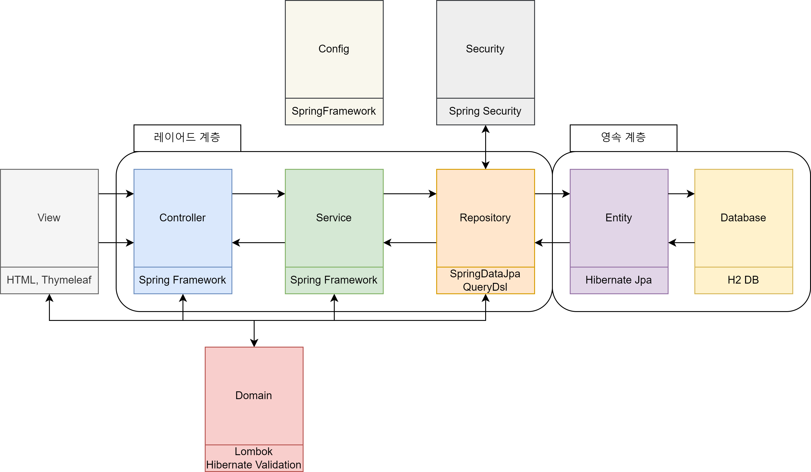
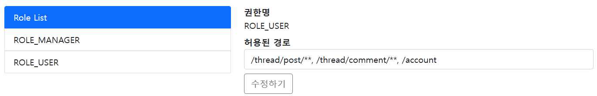

# SpringBoardAuthority

 

# 개요
- Spring Security를 활용한 동적 권한 구현
  
- Spring Data Jpa의 페이징 기능을 활용한 게시판 구현

- QueryDsl 활용한 검색 기능 구현

 

# 사용 기술

> ## BackEnd
- JDK 11
- Spring Boot v2.7.11
- Spring Data Jpa
- QueryDsl
- Spring Security
- Spring Validation
- Lombok

> ## Database
- H2 DB

> ## FrontEnd
- HTML
- Thymleaf
- BootStrap v5.1

> ## IDE
- IntelliJ IDEA

 

># 구조도

># 와이어프레임

 

># 계층 구조

 

># 엔티티 구조

 

># 서비스 설명

>## 메인 페이지

### 1. 로그인 메뉴  

- 로그인 되지 않은 경우  

  - 오른쪽 상단 메뉴에서 로그인 메뉴 또는 가입 페이지로 이동할 수 있음

 

- 로그인된 경우  

  - 로그인한 상태의 경우 위와 같이 바뀌며, 사용자의 정보와 비밀번호를 바꿀 수 있는 페이지로 이동할 수 있는 버튼과 로그아웃 버튼이 있음

 

### 2. 권한에 따른 메뉴

- 로그인 하지 않았거나 권한이 ROLE_USER 인 경우  

    - 메인 페이지로 돌아가는 메뉴만 존재함

 

- 권한이 ROLE_MANAGER 인 경우  

  - 계정 관리 페이지로 갈 수 있는 메뉴가 추가됨

 

- 권한이 ROLE_ADMIN 인 경우   

  - 롤 관리 페이지로 갈 수 있는 메뉴가 추가됨

 

### 3. 게시판

- 기본

  - 게시글을 클릭할 시 로그인 페이지로 이동함
  - 아래 쪽 숫자 버튼을 클릭하여 페이징 함
  - 게시글의 제목, 내용, 글쓴이로 검색할 수 있음

 

검색 및 페이징 내용

- 페이징

- 검색

 

- 로그인을 한 경우

  - 오른쪽 상단에 게시글을 작성하는 버튼이 추가됨

 

>## 게시글 페이지

- 게시글 페이지

  - 게시글을 보고, 수정하고 삭제할 수 있음
  - 사용자 자신이 작성한 게시글만 수정 및 삭제가 가능함

 

>## 가입 및 로그인 페이지

### 1. 가입 페이지
- 기본  

  - 유저 이름과 비밀번호 체크를 통해 계정을 생성할 수 있음

 

- 검증    

  - 잘못된 양식의 유저 이름과 비밀번호를 제출할 경우 다음과 같이 표시함

 

### 2. 로그인 페이지
- 기본  

  - 로그인 페이지를 통해 로그인할 수 있음

 

>## 사용자 계정 페이지

- 사용자 계정 페이지  

  - 로그인한 사용자 계정의 정보를 볼 수 있으며, 계정의 비밀번호를 변경할 수 있음

 

>##  관리자 페이지
### 1. 계정 관리자 페이지
- 기본  

  - 가입된 사용자의 권한을 수정하거나 계정을 삭제할 수 있음

### 2. URL 관리자 페이지 
- 기본  

  - 각 권한에게 허용된 URL을 관리함

- 검증  

  - 잘못된 입력값을 제출할 경우 다음과 같이 표시함

# 기능

- anyRequest().access() 흘 활용한 동적 권한 설정
  - 각 권한이 접근 가능한 경로 설정
  - 각 계정의 권한 설정

- 페이징 처리

- QueryDsl을 활용한 동적 쿼리

- 댓글과 대댓글 기능

- 백엔드 데이터 검증

 

# 느낀 점
- JpaRepository의 findAll() 로 뽑아와서 map() 해서 값들 뽑아오지 말기... 이거 때문에 쿼리가 비효율적으로 출력되는 것 같다.
  - QueryDsl로 대체하여 구현